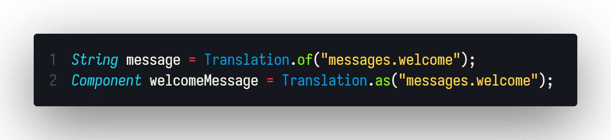

<div align="center">
  <h1>WordWeaver</h1>

  _A modern Java translation library designed for effortless localization management in Java applications._

<br>
<div>
<a href="https://github.com/milkdrinkers/WordWeaver/blob/main/LICENSE">
    
</a>
<a href="https://central.sonatype.com/artifact/io.github.milkdrinkers/wordweaver">
    
</a>

<a href="https://github.com/milkdrinkers/WordWeaver/issues">
    
</a>

<br>

<a href="https://milkdrinkers.athyrium.eu/wordweaver">
    
</a>
<a href="https://javadoc.io/doc/io.github.milkdrinkers/wordweaver">
    
</a>
<a href="https://discord.gg/cG5uWvUcM6">
    
</a>
</div>
</div>

---



## 🌟 Features

- **Easy Integration** - Simple API with minimal setup
- **Highly Configurable** - Customize every aspect of the library
- **Thread-Safe** - Designed for concurrent environments
- **Optimized** - Resource efficient with a small memory footprint while providing excellent speed
- **Adventure 4+ Support** - Native integration for modern text components
- **Java 8+ Compatibility** - Supports legacy and modern java versions
- **Tested** - Comprehensive unit test coverage
- **JSON** - Easy to edit language files using Json with comments
- **Advanced Features** - Comes with optional advanced features like language file extractor and updater

## 📦 Installation

Add WordWeaver to your project with **Maven** or **Gradle**.

<details>
<summary>Gradle Kotlin DSL</summary>

```kotlin
repositories {
    mavenCentral()
}

dependencies {
    implementation("io.github.milkdrinkers:wordweaver:VERSION")
}
```

</details>

<details>
<summary>Maven</summary>

```xml
<project>
    <dependencies>
        <dependency>
            <groupId>io.github.milkdrinkers</groupId>
            <artifactId>wordweaver</artifactId>
            <version>VERSION</version>
        </dependency>
    </dependencies>
</project>
```

</details>

## Simple Usage Example 🚀

```java
import io.github.milkdrinkers.wordweaver.Translation;
import io.github.milkdrinkers.wordweaver.config.TranslationConfig;

// Create configuration
TranslationConfig config = TranslationConfig.builder()
    .translationDirectory(Paths.of("lang")) // The directory lang files will be stored in
    .language("fr_FR") // The primary language used
    .defaultLanguage("en_US") // The fallback language
    .build();
    
// Initialize WordWeaver
Translation.initialize(config);

// Now you can use translations
String message = Translation.of("messages.welcome");
Component welcomeMessage = Translation.as("messages.welcome");
List<String> rules = Translation.ofList("server.rules");
List<Component> helpMessages = Translation.asList("help.commands");
```

Example `en_US.json`:

```json
{
  "messages": {
    "welcome": "Welcome to our server!",
    "goodbye": "Goodbye, see you soon!",
    "error": "An error occurred: {0}"
  },
  "server": {
    "rules": [
      "Be respectful to other players",
      "No griefing or stealing",
      "Have fun!"
    ]
  }
}
```

## 📚 Documentation

- [Full Javadoc Documentation](https://javadoc.io/doc/io.github.milkdrinkers/wordweaver)
- [Documentation](https://milkdrinkers.athyrium.eu/wordweaver)
- [Maven Central](https://central.sonatype.com/search?q=wordweaver&namespace=io.github.milkdrinkers)

---

## 🔨 Building from Source

```bash
git clone https://github.com/milkdrinkers/WordWeaver.git
cd wordweaver
./gradlew publishToMavenLocal
```

---

## 🔧 Contributing

Contributions are always welcome! Please make sure to read our [Contributor's Guide](CONTRIBUTING.md) for standards and our [Contributor License Agreement (CLA)](CONTRIBUTOR_LICENSE_AGREEMENT.md) before submitting any pull requests.

We also ask that you adhere to our [Contributor Code of Conduct](CODE_OF_CONDUCT.md) to ensure this community remains a place where all feel welcome to participate.

---

## 📝 Licensing

You can find the license the source code and all assets are under [here](../LICENSE). Additionally, contributors agree to the Contributor License Agreement \(_CLA_\) found [here](CONTRIBUTOR_LICENSE_AGREEMENT.md).

---

## 🔥 Consuming Projects

Here is a list of known projects using WordWeaver:

- [Minecraft-Plugin-Template](https://github.com/milkdrinkers/Minecraft-Plugin-Template) - _Provided by default in a Minecraft Plugin Template._
- [Maquillage](https://github.com/milkdrinkers/Maquillage) - _Maquillage a Minecraft cosmetics plugin._
- [CharacterCards](https://github.com/Alathra/CharacterCards) - _CharacterCards is a Minecraft plugin allowing players to create cards describing their character._
- (_Add your project here!_)
