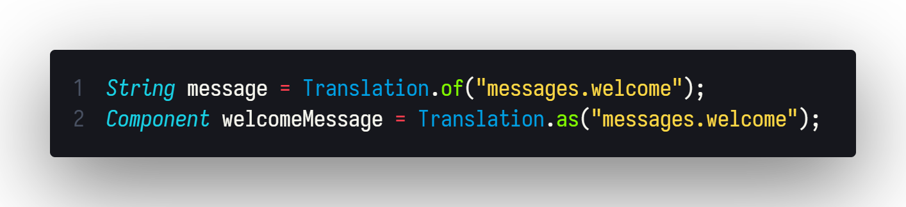

<div align="center">
  <h1>WordWeaver</h1>

  _A modern Java translation library designed for effortless localization management in Java applications._

<br>
<div>
<a href="https://github.com/milkdrinkers/WordWeaver/blob/main/LICENSE">
    
</a>
<a href="https://central.sonatype.com/artifact/io.github.milkdrinkers/wordweaver">
    
</a>

<a href="https://github.com/milkdrinkers/WordWeaver/issues">
    
</a>

<br>

<a href="https://docs.milkdrinkers.dev/wordweaver">
    
</a>
<a href="https://javadoc.io/doc/io.github.milkdrinkers/wordweaver">
    
</a>
<a href="https://discord.gg/cG5uWvUcM6">
    
</a>
</div>
</div>

---



## 🌟 Features

- **Easy Integration** - Simple API with minimal setup
- **Highly Configurable** - Customize every aspect of the library
- **Thread-Safe** - Designed for concurrent environments
- **Optimized** - Resource efficient with a small memory footprint while providing excellent speed
- **Adventure 4+ Support** - Native integration for modern text components
- **Java 8+ Compatibility** - Supports legacy and modern java versions
- **Tested** - Comprehensive unit test coverage
- **Multiple File Formats** - `.properties` support out of the box, with `.json`/`.jsonc` modules, or add your own format through optional parser modules
- **Advanced Features** - Comes with optional advanced features like translation file extractor and updater

## 📦 Installation

Add WordWeaver to your project with **Maven** or **Gradle**. The core artifact ships with a `.properties` parser out of the box. To read `.json`/`.jsonc` files, add one of the optional JSON parser modules. Parser modules register themselves automatically once they are on the classpath.

### Core

<details>
<summary>Gradle Kotlin DSL</summary>

```kotlin
repositories {
    mavenCentral()
}

dependencies {
    implementation("io.github.milkdrinkers:wordweaver:VERSION")
}
```

</details>

<details>
<summary>Maven</summary>

```xml
<dependency>
    <groupId>io.github.milkdrinkers</groupId>
    <artifactId>wordweaver</artifactId>
    <version>VERSION</version>
</dependency>
```

</details>

### JSON/JSONC support *(Optional)*

Pick **one** of the following, do not add both:

- `wordweaver-json` - you provide the [GSON](https://github.com/google/gson) dependency yourself. Best when GSON is already on your classpath (*e.g. like on platforms like PaperMC*).
- `wordweaver-json-shaded` - GSON comes bundled and relocated (*shaded*).

<details>
<summary>Gradle Kotlin DSL</summary>

```kotlin
dependencies {
    implementation("io.github.milkdrinkers:wordweaver:VERSION")

    // Option A, bring your own GSON
    implementation("io.github.milkdrinkers:wordweaver-json:VERSION")
    implementation("com.google.code.gson:gson:x.x.x")

    // Option B, uses included GSON
    implementation("io.github.milkdrinkers:wordweaver-json-shaded:VERSION")
}
```

</details>

<details>
<summary>Maven</summary>

```xml
<!-- Option A, bring your own GSON -->
<dependency>
    <groupId>io.github.milkdrinkers</groupId>
    <artifactId>wordweaver-json</artifactId>
    <version>VERSION</version>
</dependency>
<dependency>
    <groupId>com.google.code.gson</groupId>
    <artifactId>gson</artifactId>
    <version>x.x.x</version>
</dependency>

<!-- Option B, uses included GSON -->
<dependency>
    <groupId>io.github.milkdrinkers</groupId>
    <artifactId>wordweaver-json-shaded</artifactId>
    <version>VERSION</version>
</dependency>
```

</details>

### Shading

Most users shade WordWeaver and its parser modules into their own jar. When you build a fat jar, you **must** merge service files so that every parser stays registered.

<details>
<summary>Gradle (Shadow)</summary>

```kotlin
tasks.shadowJar {
    relocate("io.github.milkdrinkers.wordweaver", "yourpackage.wordweaver")

    mergeServiceFiles()
}
```

</details>

<details>
<summary>Maven (Shade)</summary>

```xml
<plugin>
    <groupId>org.apache.maven.plugins</groupId>
    <artifactId>maven-shade-plugin</artifactId>
    <version>3.5.0</version>
    <executions>
        <execution>
            <phase>package</phase>
            <goals>
                <goal>shade</goal>
            </goals>
        </execution>
    </executions>
    <configuration>
        <relocations>
            <relocation>
                <pattern>io.github.milkdrinkers.wordweaver</pattern>
                <shadedPattern>yourpackage.wordweaver</shadedPattern>
            </relocation>
        </relocations>
        <transformers>
            <transformer implementation="org.apache.maven.plugins.shade.resource.ServicesResourceTransformer"/>
        </transformers>
    </configuration>
</plugin>
```

</details>

## Usage Example

```java
import io.github.milkdrinkers.wordweaver.Translation;
import io.github.milkdrinkers.wordweaver.config.TranslationConfig;

// Create configuration
TranslationConfig config = TranslationConfig.builder()
    .namespace("wordweaver:example") // The namespace of your plugin/mod (required)
    .translationDirectory(Paths.get("lang")) // The directory bundle files will be stored in
    .locale("fr_FR") // The active locale
    .defaultLocale("en_US") // The fallback locale
    .build();
    
// Initialize WordWeaver
Translation.initialize(config);

// Use translations
String message = Translation.of("messages.welcome");
Component welcomeMessage = Translation.as("messages.welcome");
List<String> rules = Translation.ofList("server.rules");
List<Component> helpMessages = Translation.asList("help.commands");
```

Example `en_US.json`:

```json
{
  "messages": {
    "welcome": "Welcome to our server!",
    "goodbye": "Goodbye, see you soon!",
    "error": "An error occurred: {0}"
  },
  "server": {
    "rules": [
      "Be respectful to other players",
      "No griefing or stealing",
      "Have fun!"
    ]
  }
}
```

### Translatable Components

WordWeaver registers with Adventure's [`GlobalTranslator`](https://docs.advntr.dev/localization.html), so your translations are also available as **translatable components**, rendered in each viewer's own locale. This allows your translations to have indexed (`<arg:0>`) and named (`<name>`) arguments.

Example `en_US.json`:

```json
{
  "messages": {
    "welcome": "<gradient:green:aqua>Welcome, <arg:0>!</gradient>",
    "joined": "<gray><player> joined the game</gray>"
  }
}
```

Reference keys directly:

```java
// Indexed argument -> <arg:0>
audience.sendMessage(Component.translatable("messages.welcome", Component.text(name)));

// Named argument -> <player> (net.kyori.adventure.text.minimessage.translation.Argument)
audience.sendMessage(Component.translatable("messages.joined", Argument.component("player", Component.text(name))));

// Or directly from any MiniMessage string via the <lang> tag
audience.sendMessage(MiniMessage.miniMessage().deserialize("<gray>[Server]</gray> <lang:messages.welcome:'" + name + "'>"));
```

## 📚 Documentation

- [Full Javadoc Documentation](https://javadoc.io/doc/io.github.milkdrinkers/wordweaver)
- [Documentation](https://docs.milkdrinkers.dev/wordweaver)
- [Maven Central](https://central.sonatype.com/search?q=wordweaver&namespace=io.github.milkdrinkers)

---

## 🔨 Building from Source

```bash
git clone https://github.com/milkdrinkers/WordWeaver.git
cd wordweaver
./gradlew publishToMavenLocal
```

---

## 🔧 Contributing

Contributions are always welcome! Please make sure to read our [Contributor's Guide](CONTRIBUTING.md) for standards and our [Contributor License Agreement (CLA)](CONTRIBUTOR_LICENSE_AGREEMENT.md) before submitting any pull requests.

We also ask that you adhere to our [Contributor Code of Conduct](CODE_OF_CONDUCT.md) to ensure this community remains a place where all feel welcome to participate.

---

## 📝 Licensing

You can find the license the source code and all assets are under [here](../LICENSE). Additionally, contributors agree to the Contributor License Agreement \(_CLA_\) found [here](CONTRIBUTOR_LICENSE_AGREEMENT.md).

---

## 🔥 Consuming Projects

Here is a list of known projects using WordWeaver:

- [Minecraft-Plugin-Template](https://github.com/milkdrinkers/Minecraft-Plugin-Template) - _Provided by default in a Minecraft Plugin Template._
- [Maquillage](https://github.com/milkdrinkers/Maquillage) - _Maquillage a Minecraft cosmetics plugin._
- [CharacterCards](https://github.com/Alathra/CharacterCards) - _CharacterCards is a Minecraft plugin allowing players to create cards describing their character._
- (_Add your project here!_)
